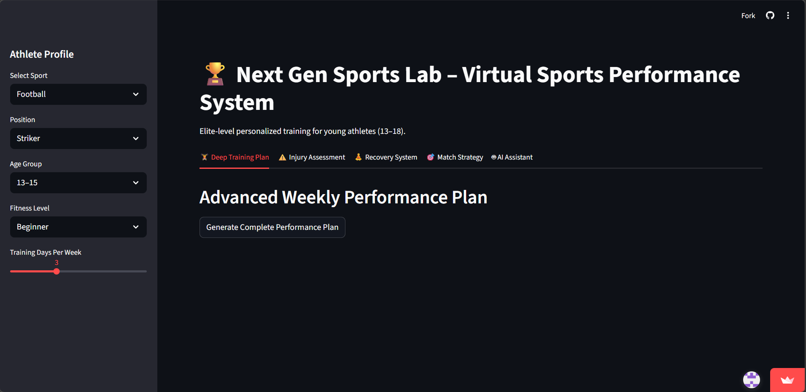
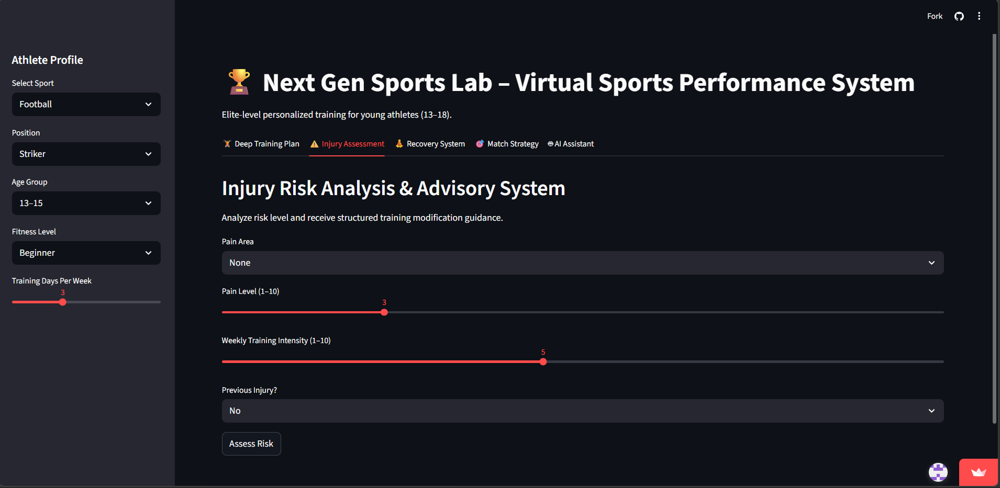
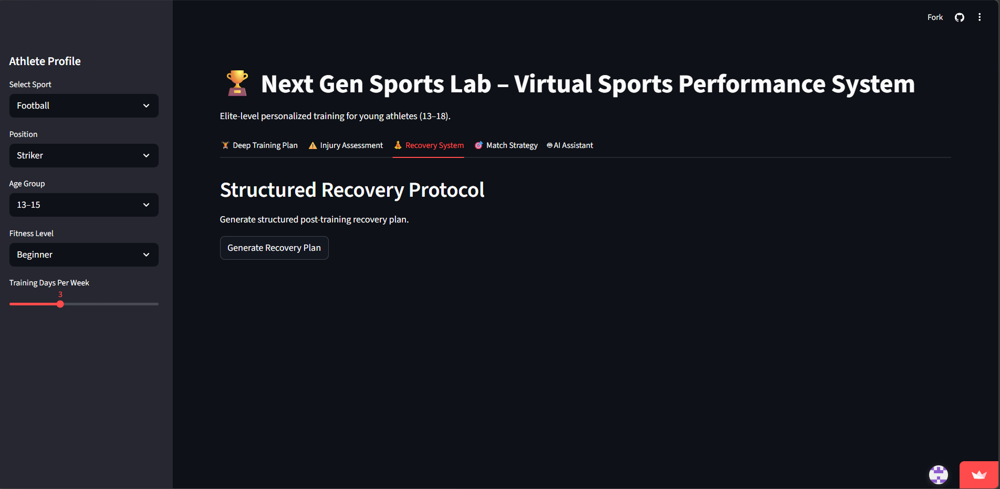
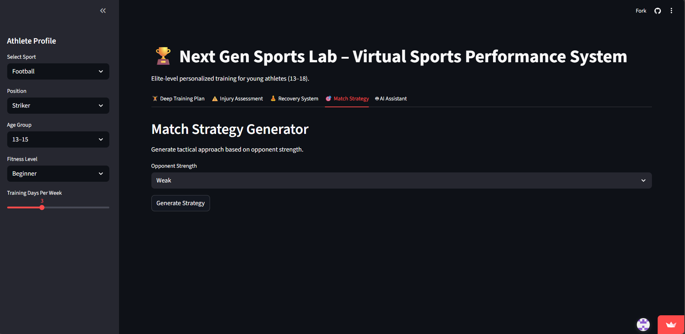
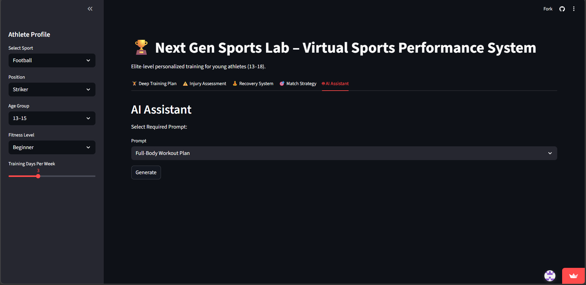

# 🏆 Next Gen Sports Lab — AI-Powered Smart Fitness Assistant

**Student Name:** NAMAN OM SHRESTHA

**Student ID:** 1000432

**Course:** Artificial Intelligence - Generative AI

**School:** ASPEE NUTAN ACADEMY 

**Assessment Type:** Summative Assessment (Individual)

**Project Title:** Building AI-Powered Web Applications for Real-World Solutions

---

## 🔗 Project Links

| Resource | Link |
| --- | --- |
| 🚀 Live App | [Open Live App Here](https://idai103-1000432-naman-om-shrestha-sa.streamlit.app/) |
| 💻 GitHub Repo | [View Source Code](https://github.com/Bravenaman/IDAI103-1000432-NAMAN-OM-SHRESTHA-SA) |

---

## 📋 Project Overview

**CoachBot AI** is a Streamlit-based interactive sports performance application designed to support athletes in structured training, injury awareness, and match preparation. The system allows users to select their sport, playing position, injury condition, and number of weekly training days to generate personalized workout plans.

The application dynamically adjusts training intensity based on injury status and distributes workouts logically across selected days to avoid repetition. Additionally, it provides recovery recommendations and match strategy insights, simulating the role of an AI-powered digital coach.

The primary aim of this project is to combine logical programming with real-world sports performance concepts to create an intelligent and practical athlete support system.

---

## ❗ Problem Statement

Many athletes train without structured planning or proper injury awareness. This often leads to:

* Repetitive workouts
* Poor recovery management
* Increased injury risk
* Lack of match-specific strategies
  
This project addresses these isses by:

* Generating sport-specific workot plans
* Adjusting training intensity based on injury status
* Providing recovery recommendations
* Offering strategic match insights

---

## 🎯 Project Objectives

* To develop a structured AI-based sports performance assistant.
* To generate dynamic workout plans based on selected training days.
* To assess injury status and provide recovery guidance.
* To provide match strategy recommendations based on sport and position.
* To integrate AI for more personalized and interactive user responses.

---

## ✨ Key Features

### 🏋️ Core Functionality

* **Dynamic Athlete Profiling:** Captures sport, position, injury status, and number of training days to generate structured recommendations.
* **Injury-Aware Training Logic:** Adjusts workout intensity and exercise selection based on reported injury type and severity.
* **Sport & Position-Specific Strategy Engine: Generates match strategy insights tailored to the athlete’s role.
* **Integrated Recovery System:** Provides rehabilitation guidance and load management suggestions.
* **Risk Assessment Indicator:** Highlights potential overtraining or injury risks based on user inputs.
* **Multi-Day Workout Generator:** Creates non-repetitive, structured plans distributed across selected training days.

### 📊 Visual Dashboard & Analytics

* **Tab-Based Navigation System:** Separates Injury Assessment, Recovery System, Workout Plan, Match Strategy, and CoachBot modules for clarity.
* **Risk Highlight Panels:** Visual alerts for high-risk conditions or excessive training load.
* **Performance Insight Sections:** Displays structured recommendations in categorized output blocks.
* **Logical Training Distribution Analytics:** Ensures balanced intensity variation to prevent repetitive or overload training.
* **Structured Day-by-Day Plan Display:** Clearly formatted training distribution across selected days.

---

## 🎨 User Interface Design

* **Structured Sidebar Control Panel:** A clean left-hand sidebar is used for selecting sport, position, injury status, and training days. This keeps user inputs separate from generated outputs for better clarity.
* **Tab-Based Navigation System:** The interface is divided into organized tabs:

🏥 Injury Assessment
🔄 Recovery System
🏋️ Workout Generator
🎯 Match Strategy
🤖 CoachBot Assistant
This improves usability by preventing information overload.

* **Clear Section Separation:** Each feature displays results in well-defined sections using headers and spacing to maintain readability and logical flow.
* **Risk & Alert Highlighting:** Important warnings (such as high injury risk or training overload) are visually emphasized using alert-style components to draw immediate attention.
* **Dynamic Output Display:** Workout plans are generated and displayed day-by-day in structured format, ensuring no repetition and clear training progression.
* **Minimal & Professional Theme:** The design prioritizes clarity over visual clutter, supporting a performance-focused and decision-based user experience.

---

## � App Screenshots







---

## �🔧 Technical Architecture

### Technologies Used

* **Python 3.x** — Core application logic and structured decision-making system.
* **Streamlit** — Interactive web interface, sidebar routing, tab navigation, and UI components.
* **Random Module** — Generates varied multi-day workout plans to prevent repetition.
* **Streamlit Session State** — Maintains user selections and dynamic updates across tabs.

### Decision Logic Strategy

The app utilizes a structured Input + Evaluation + Recommendation logic flow:

```text
Input: Sport (Football), Position (Midfielder), Injury (Mild Ankle Strain), Training Days (5)
Evaluation: Assess injury severity, adjust training intensity, distribute workload logically.
Output: Generate a Safe, Multi-Day Training Plan with Recovery Advice and Match Strategy.

```
This structured logic ensures the system:

* Always considers injury status before generating workouts.
* Adjusts intensity levels based on risk factors.
* Distributes exercises logically across selected training days.
* Avoids repetitive single-day workout loops.

---

📁 Project Structure

```text
IDAI103-1000432-Naman-Om-Shrestha-SA/
│
├── app.py                  # Main Streamlit application
├── requirements.txt        # Python dependencies
├── README.md               # Project documentation
│
├── interactive links/      # GitHub & Streamlit links
│   └── README.md

```

---

# 🚀 Project Development Stages
  
### 🧠 Stage 1: Problem Definition & Planning

Identified common challenges faced by athletes, including repetitive training routines, injury mismanagement, and lack of structured match preparation. Researched position-specific training principles and safe workload distribution methods to ensure realistic system logic.

### 🏗️ Stage 2: System Design & Logic Structuring

Designed a rule-based performance engine to generate sport-specific and position-based recommendations. Structured conditional logic to dynamically adjust workouts based on injury status and selected training days, ensuring non-repetitive and balanced outputs.

### 🖥️ Stage 3: UI/UX Development

Built the interactive Streamlit interface using sidebar inputs and tab-based navigation. Organized the application into core modules (Injury Assessment, Recovery, Workout Generator, Match Strategy, CoachBot) for clarity and usability.

### 🧪 Stage 4: Testing & Refinement

Tested multiple input combinations, including edge cases (high training days with injury conditions), to ensure logical consistency and safe recommendations. Refined workout distribution logic to prevent repetition and overload scenarios.

### 🌐 Stage 5: Deployment & Optimization

Prepared the project structure, configured dependencies, and deployed the application using Streamlit Cloud. Optimized performance to ensure smooth interaction and clean output formatting.

---

## ⚙️ Deployment Instructions

### 💻 Local Deployment

1. Clone the repository:

```bash
git clone https://github.com/YourUsername/IDAI103-1000432-Naman-Om-Shrestha-SA.git
cd IDAI103-1000432-Naman-Om-Shrestha-SA

```

2. Install required dependencies:

```bash
pip install -r requirements.txt

```

3. Run the Streamlit application:

```bash
streamlit run app.py

```

### ☁️ Cloud Deployment (Streamlit Cloud)

Push your project to a public GitHub repository.
Visit (https://streamlit.io/cloud) and sign in.
Click “New app”.
Select your GitHub repository.
Set the main file path to: 'app.py'

6. Click Deploy.

The application will be automatically hosted and accessible through a public link.

🌱 Ethical & Social Considerations

🛡 Safety & Health

CoachBot AI provides structured training recommendations; however, it clearly emphasizes that AI-generated advice does not replace professional coaching or medical clearance. Injury-related suggestions are conservative and prioritize recovery over performance to reduce risk.

🌍 Inclusivity

The application promotes accessible sports guidance by providing structured performance insights without financial barriers. It aims to support youth athletes who may not have access to professional coaching resources.

🔐 Data Privacy

The application does not use a backend database or store personal data. All user inputs (sport, position, injury status) are session-based and reset when the browser is closed, ensuring privacy and security.
